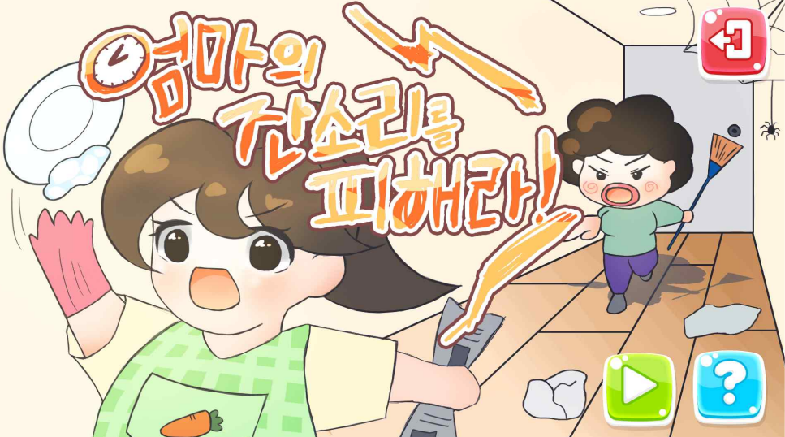

# 엄마의 잔소리를 피해라!

**개발:** C#, PC, Unity
**업무포지션:** 대학생, 클라이언트 프로그래머

## 👩‍🏫PROJECT 소개

CK사업단에서 주관하는 “삼삼오오 프로젝트” 에서 게임개발

🗓️ **작업기간** : 2일

👨‍💻 **투입인원** : 3인 (그래픽1인, 기획 1인, 프로그래밍 1인)

🙋‍♀️ **기여도 :** 60% 

📒 **주요업무** 

- 엄마의 잔소리를 피해라 프로그래밍 담당

🌱 **스킬 및 사용툴**

 `c#` `unity` `git` 

## 🖌️더 알아보기

### 플레이 영상

[https://www.youtube.com/watch?v=U2-rJAl7hxc&feature=youtu.be](https://www.youtube.com/watch?v=U2-rJAl7hxc&feature=youtu.be)